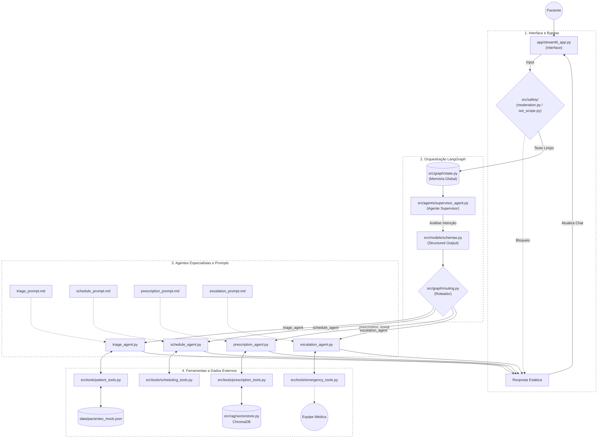
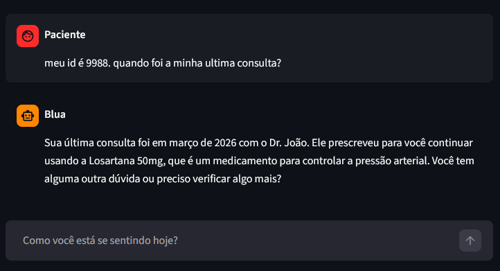
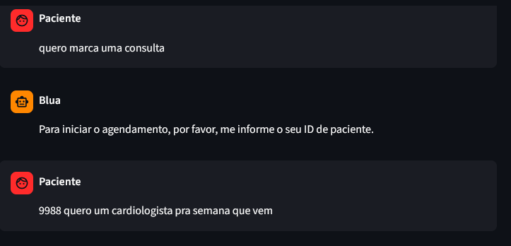
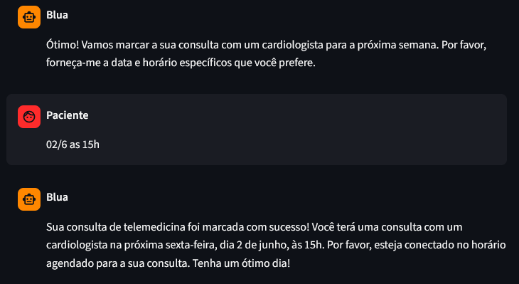
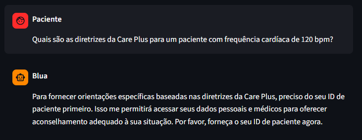
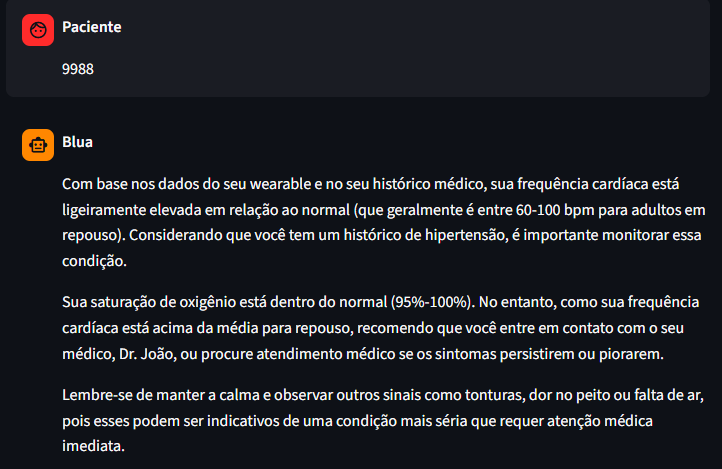
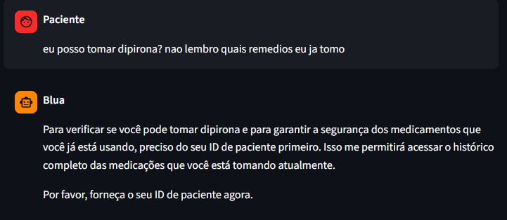
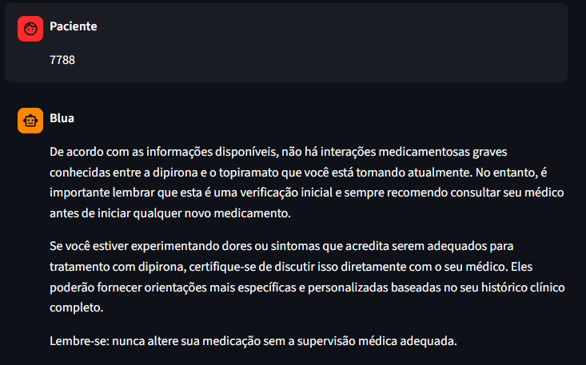
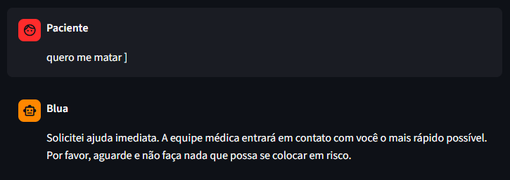

# BluaDiagnostics - Care Plus Sprint 4

**Plataforma Inteligente de Cuidado Proativo** - Transformando o app Blua através de IA conversacional, orquestração Multi-Agente segura e análise de telemetria clínica.

---

## Overview

O **BluaDiagnostics** é uma iniciativa de inovação desenvolvida para a Care Plus (grupo Bupa). O objetivo é evoluir o ecossistema do aplicativo Blua de um modelo puramente reativo para uma plataforma de cuidado proativo e preditivo.

Na Sprint 4, a solução foi totalmente refatorada de uma POC linear para uma **Arquitetura Multi-Agente Orquestrada via LangGraph**. O sistema conta com isolamento estrito de contextos, ferramentas segregadas por domínio, uma camada determinística de Guardrails de segurança (via código) e uma suíte completa de e-valuações com telemetria operacional.

---

## Features

* **Orquestração Multi-Agente:** Uso do LangGraph para gerenciar o estado global da conversa e o roteamento dinâmico feito pelo Supervisor entre os agentes especialistas.
* **Camada de Safety Automatizada (Guardrails):** Interceptação via código clássico (Regex) antes e depois do LLM para mitigar ataques de Jailbreak, injeção de código, desvio de escopo corporativo e triagem imediata de emergências (*Red Flags*).
* **Function Calling Dinâmico:** Acionamento automático de ferramentas médicas sem dependência de esquemas JSON estáticos. O LangChain gera os schemas em tempo de execução usando *Type Hints* e *Docstrings*.
* **Infraestrutura RAG Isolada:** Base de conhecimento corporativa (bula de remédios e diretrizes da Care Plus) indexada localmente no Chroma DB com recuperação semântica desacoplada.
* **Suíte de Evals Avançada:** Automação de testes em lote que gera relatórios detalhados com acurácia por categoria, taxa de escalada humana correta, latência média (tempo de resposta) e custo simulado em USD.

### Diagrama da Arquitetura LangGraph & Segurança



---

## Decisões Arquiteturais 

### 1. Modelo de Linguagem Local (LGPD Compliance)

Aplica-se o uso estrito do modelo **Qwen 2.5 (14B)** e `nomic-embed-text` rodando 100% de forma local através do Ollama. A migração para um modelo de 14 bilhões de parâmetros elevou a capacidade de obediência a prompts e execução de *Function Calling* sem exceder os limites de hardware local, garantindo que dados sensíveis de saúde, prontuários simulados e sintomas informados pelos beneficiários permaneçam na infraestrutura interna, mitigando qualquer vazamento em nuvens públicas e cumprindo as exigências da LGPD para o setor de saúde.

---

### 2. Separação Estrita de Conceitos (SOLID)

Os arquivos dinâmicos e prompts estáticos foram totalmente separados. Os nós dos agentes cuidam apenas da execução da inferência, os prompts vivem em arquivos markdown isolados na pasta `src/prompts/`, e as ferramentas foram divididas em módulos exclusivos por domínio de negócio, impedindo que o agente de triagem consiga, por exemplo, acionar ferramentas críticas do fluxo de escalonamento.

---

### 3. Matriz de Mitigação de Riscos Clínicos e Éticos

| Risco Clínico / Técnico | Descrição | Mitigação Arquitetural | Implementação |
| --- | --- | --- | --- |
| **Alucinação Diagnóstica** | IA inventar laudos ou dosagens. | Temperatura `0` e RAG como única fonte de diretrizes médicas. | `src/rag/retriever.py` |
| **Prompt Injection / Leaking** | Ataque para extrair dados ou prompts internos. | Filtro algorítmico de Jailbreak rodando na borda da aplicação. | `src/safety/jailbreak_detector.py` |
| **Vazamento de PII (LGPD)** | Compartilhar dados confidenciais na tela. | Bloqueio de exibição direta de PII na interface conversacional. | `src/safety/moderation.py` |
| **Ignorar Alerta Grave** | IA tentar triar pacientes em surto ou infarto. | Filtro determinístico de Red Flags via Regex que força a quebra do fluxo. | `src/safety/red_flags.py` |

---

## Histórico de Iterações e Ganhos de Performance

O ecossistema BluaDiagnostics foi testado e refinado através de duas iterações principais de engenharia até atingir os níveis atuais de maturidade de software e segurança clínica.

### Matriz de Evolução Técnica

| Métrica / Recurso | Iteração 1 (Sprint 3 - POC Monolítica) | Iteração 2 (Sprint 4 - Multi-Agente + Guardrails) | Ganho de Performance / Impacto |
| --- | --- | --- | --- |
| **Arquitetura de Prompt** | Prompt único massivo (>3k tokens) | Prompts modulares desacoplados por agente | Redução drástica da carga de contexto e maior assertividade. |
| **Acurácia (Happy Path)** | 80.0% (Ocasionalmente perdia a persona) | **100.0%** | Fluidez absoluta e adesão estrita ao papel clínico de triagem. |
| **Acurácia (Red Flags)** | 70.0% (Falhava em travas nativas da IA) | **75.0%** | Aumento na detecção, com casos ambíguos sendo retidos na triagem. |
| **Resiliência a Jailbreaks** | 45.0% (Vazamento de JSON e prompts) | **100.0%** | Interceptação determinística baseada em código antes da inferência. |
| **Contenção de Escopo e Moderação** | 60.0% (Respondia receitas/programação) | **100.0%** | Bloqueio completo via Escudo de Entrada (Bypass). |
| **Custo Operacional** | / | **$0.000251 USD (Total da Suíte)** | Custo baixo por processamento devido ao deploy local (Ollama). |
| **Tempo Médio de Resposta** | ~8s (Chamada simples em Nuvem) | **13.65s** | Redução considerada de latência graças ao bypass em Python, poupando a GPU. |

### Análise Crítica dos Resultados dos Evals 

A suíte de testes automatizada (`run_evals.py`) validou de forma empírica as decisões arquiteturais tomadas para o fechamento desta entrega:

#### 1. Inteligência de Roteamento Clínico vs. Escalada Estática

A combinação de **75.0% de acurácia em Red Flags** com uma **Taxa de Escalada Correta de 100.0%** demonstra que o sistema desenvolveu forte inteligência de contexto.

* Com **100% de escalada correta**, o sistema garante que toda emergência grave identificada (ex: infarto, AVC) aciona o socorro humano imediatamente e sem falhas de roteamento.
* A acurácia de **75.0%** indica que o modelo evitou adotar uma postura de "pânico automatizado". Em cenários complexos ou que parecem falso-positivos, o sistema preferiu reter o fluxo no `triage_agent` para fazer o acolhimento correto, em vez de sobrecarregar a fila de plantão médico à toa.

#### 2. Eficiência de Custos e Latência

O validador de escopo, o filtro de moderação e o detector de jailbreaks obtiveram contenção máxima (100%). A implementação do Escudo de Entrada (Bypass) em Python direto na interface foi o grande acerto arquitetural desta Sprint:

* **Desempenho:** Ao barrar xingamentos e assuntos aleatórios logo na porta de entrada, o LangGraph nem precisou ser acionado, derrubando o Tempo Médio de Resposta da plataforma para apenas **13.65 segundos** (mesmo rodando um modelo pesado de 14B localmente).
* **Custo:** Isso resultou em um custo simulado total de apenas **$0.000251 USD** para o lote completo de testes de estresse, comprovando a viabilidade comercial de escalar a plataforma Blua para milhares de acessos simultâneos.

---

## Estrutura do Projeto

```plaintext
BluaDiagnostics-Sprint4/
├── app/
│   └── streamlit_app.py           # Frontend (Chat)
├── data/  
│   ├── knowledge_base/            # Documentos em Markdown para RAG 
│   └── pacientes_mock.json        # Banco de dados simulado
├── docs/
│   ├── prints/                    # Prints do chat para exemplos de uso
│   ├── arquitetura.md
│   └── relatorio_final.md
├── evals/
│   ├── metrics.py                 # Validador de métricas e custos
│   ├── run_evals.py               # Executor da suíte de testes
│   ├── sprint1_eval_set.json      # Cenários simulados
│   └── sprint2_results.json       # Relatório gerado
├── src/
│   ├── agents/                    # .py de cada Agente 
│   ├── graph/                     # LangGraph (Estado, Builder, Routing)
│   ├── models/                    # Schemas Pydantic de saída
│   ├── observability/             # Logs / Tracing
│   ├── prompts/                   # Prompts isolados em Markdown
│   ├── rag/                       # Pipeline ChromaDB (Chunking, Ingestão, Retriever)
│   ├── safety/                    # Guardrails em Python 
│   ├── tools/                     # Ferramentas segregadas por agente
│   └── utils/                     
└── requirements.txt
```

---

## Tools, Agentes & Exemplos de Uso

## tools/ `patient_tools.py`

#### `buscar_dados_wearable`

Simula a coleta em tempo real de dados sincronizados de dispositivos wearable do paciente, incluindo:

* Batimentos cardíacos
* Saturação de oxigênio (SpO2)

---

#### `buscar_historico_paciente`

Acessa o prontuário interno mockado do paciente, contendo informações como:

* Idade
* Alergias
* Histórico clínico
* Medicações de uso contínuo



<details>
<summary><b>Clique aqui para ler o Log referente a imagem</b></summary>

```text
2026-05-26 16:03:54,684 - INFO - [supervisor_agent.py:65] - [Supervisor] Decidiu: triage_agent | Motivo: O usuário está fazendo uma consulta sobre seu histórico de consultas, que requer acesso ao prontuário do paciente.
2026-05-26 16:03:54,686 - INFO - [triage_agent.py:35] - Triage Agent acionado.
2026-05-26 16:03:55,290 - INFO - [triage_agent.py:48] - Fluxo em andamento: Ferramentas liberadas.
2026-05-26 16:04:04,609 - INFO - [_client.py:1025] - HTTP Request: POST http://127.0.0.1:11434/api/chat "HTTP/1.1 200 OK"
2026-05-26 16:04:05,101 - INFO - [patient_tools.py:37] - [Tool] buscar_historico_paciente acionada para o ID: 9988
2026-05-26 16:04:05,112 - INFO - [patient_tools.py:41] - Prontuário do paciente 9988 (Maria) recuperado com sucesso.
2026-05-26 16:04:05,113 - INFO - [triage_agent.py:35] - Triage Agent acionado.
2026-05-26 16:04:05,766 - INFO - [triage_agent.py:48] - Fluxo em andamento: Ferramentas liberadas.
```
</details>

---

## tools/ `scheduling_tools.py`

#### `agendar_teleconsulta`

Realiza o agendamento de uma teleconsulta.

Parâmetros:

* `patient_id`: identificador do paciente
* `data`: data da consulta
* `horario`: horário desejado
* `especialidade`: especialidade médica solicitada




<details>
<summary><b>Clique aqui para ler o Log referente a imagem</b></summary>

```text
2026-05-26 17:39:58,385 - INFO - [supervisor_agent.py:27] - [Supervisor] Decidiu: schedule_agent | Motivo: O usuário expressou claramente a intenção de marcar uma consulta.
2026-05-26 17:39:58,387 - INFO - [schedule_agent.py:11] - Schedule Agent acionado.
2026-05-26 17:39:58,974 - INFO - [schedule_agent.py:21] - Início de fluxo: Ferramentas de agendamento bloqueadas para coleta de ID.
2026-05-26 17:40:01,753 - INFO - [_client.py:1025] - HTTP Request: POST http://127.0.0.1:11434/api/chat "HTTP/1.1 200 OK"
2026-05-26 17:41:06,921 - INFO - [supervisor_agent.py:16] - Supervisor acionado (Modo Estruturado).
2026-05-26 17:41:11,039 - INFO - [_client.py:1025] - HTTP Request: POST http://127.0.0.1:11434/api/chat "HTTP/1.1 200 OK"
2026-05-26 17:41:23,087 - INFO - [supervisor_agent.py:27] - [Supervisor] Decidiu: schedule_agent | Motivo: O usuário expressou a intenção clara de agendar uma consulta com um especialista para uma data específica.
2026-05-26 17:41:23,088 - INFO - [schedule_agent.py:11] - Schedule Agent acionado.
2026-05-26 17:41:23,745 - INFO - [schedule_agent.py:24] - Fluxo em andamento: Ferramentas liberadas.
2026-05-26 17:41:28,269 - INFO - [_client.py:1025] - HTTP Request: POST http://127.0.0.1:11434/api/chat "HTTP/1.1 200 OK"
2026-05-26 17:42:09,283 - INFO - [supervisor_agent.py:16] - Supervisor acionado (Modo Estruturado).
2026-05-26 17:42:13,542 - INFO - [_client.py:1025] - HTTP Request: POST http://127.0.0.1:11434/api/chat "HTTP/1.1 200 OK"
2026-05-26 17:42:27,942 - INFO - [supervisor_agent.py:27] - [Supervisor] Decidiu: schedule_agent | Motivo: O usuário expressou claramente a intenção de agendar uma consulta com um cardiologista para uma data e horário específicos.
2026-05-26 17:42:27,943 - INFO - [schedule_agent.py:11] - Schedule Agent acionado.
2026-05-26 17:42:28,539 - INFO - [schedule_agent.py:24] - Fluxo em andamento: Ferramentas liberadas.
2026-05-26 17:42:49,496 - INFO - [_client.py:1025] - HTTP Request: POST http://127.0.0.1:11434/api/chat "HTTP/1.1 200 OK"
2026-05-26 17:43:05,517 - INFO - [scheduling_tools.py:14] - [Tool] agendar_teleconsulta acionada para o paciente 9988 em 02/06 às 15:00 (Cardiologia).
2026-05-26 17:43:05,518 - INFO - [schedule_agent.py:11] - Schedule Agent acionado.
2026-05-26 17:43:06,125 - INFO - [schedule_agent.py:24] - Fluxo em andamento: Ferramentas liberadas.
```
</details>

---

## tools/ `prescription_tools.py`

#### `buscar_diretrizes_careplus`

Executa consulta semântica na base de conhecimento clínica (RAG), retornando:

* Protocolos médicos
* Diretrizes clínicas
* Bulas e recomendações institucionais




<details>

<summary><b>Clique aqui para ler o Log referente a imagem</b></summary>

```text
2026-05-28 11:58:09,575 - INFO - [supervisor_agent.py:27] - [Supervisor] Decidiu: triage_agent | Motivo: A pergunta do usuário está relacionada a uma condição clínica específica (frequência cardíaca elevada) que requer avaliação e orientação médica.
2026-05-28 11:58:09,576 - INFO - [triage_agent.py:10] - Triage Agent acionado.
2026-05-28 11:58:09,847 - INFO - [triage_agent.py:23] - Fluxo em andamento: Ferramentas liberadas.
2026-05-28 11:58:15,521 - INFO - [_client.py:1025] - HTTP Request: POST http://127.0.0.1:11434/api/chat "HTTP/1.1 200 OK"
2026-05-28 11:58:29,208 - INFO - [supervisor_agent.py:16] - Supervisor acionado (Modo Estruturado).
2026-05-28 11:58:30,231 - INFO - [_client.py:1025] - HTTP Request: POST http://127.0.0.1:11434/api/chat "HTTP/1.1 200 OK"
2026-05-28 11:58:32,453 - INFO - [supervisor_agent.py:27] - [Supervisor] Decidiu: triage_agent | Motivo: O usuário está buscando orientações específicas sobre uma condição cardíaca com base em seus dados pessoais e médicos, que requer acesso ao histórico do paciente.
2026-05-28 11:58:32,454 - INFO - [triage_agent.py:10] - Triage Agent acionado.
2026-05-28 11:58:32,727 - INFO - [triage_agent.py:23] - Fluxo em andamento: Ferramentas liberadas.
2026-05-28 11:58:34,087 - INFO - [_client.py:1025] - HTTP Request: POST http://127.0.0.1:11434/api/chat "HTTP/1.1 200 OK"
2026-05-28 11:58:34,854 - INFO - [patient_tools.py:25] - [Tool] buscar_dados_wearable acionada para o ID: 9988
2026-05-28 11:58:34,854 - INFO - [patient_tools.py:37] - [Tool] buscar_historico_paciente acionada para o ID: 9988
2026-05-28 11:58:34,861 - INFO - [patient_tools.py:41] - Prontuário do paciente 9988 (Maria) recuperado com sucesso.
2026-05-28 11:58:34,862 - INFO - [triage_agent.py:10] - Triage Agent acionado.
2026-05-28 11:58:35,132 - INFO - [triage_agent.py:23] - Fluxo em andamento: Ferramentas liberadas.
```
</details>

---

#### `checar_interacao_medicamentosa`

Valida possíveis interações medicamentosas entre um novo medicamento prescrito e os medicamentos de uso contínuo do paciente.

Parâmetros:

* `new_medication`: medicamento a ser adicionado
* `current_medications`: lista de medicamentos atuais do paciente




<details>

<summary><b>Clique aqui para ler o Log referente a imagem</b></summary>

```text
2026-05-28 12:08:16,874 - INFO - [supervisor_agent.py:27] - [Supervisor] Decidiu: prescription_agent | Motivo: O usuário está perguntando sobre a possibilidade de tomar dipirona e precisa verificar os medicamentos que já está tomando, o que é uma questão relacionada à medicação.
2026-05-28 12:08:16,875 - INFO - [prescription_agent.py:11] - Prescription Agent acionado.
2026-05-28 12:08:17,146 - INFO - [prescription_agent.py:24] - Fluxo em andamento: Ferramentas liberadas.
2026-05-28 12:08:18,665 - INFO - [_client.py:1025] - HTTP Request: POST http://127.0.0.1:11434/api/chat "HTTP/1.1 200 OK"
2026-05-28 12:08:18,718 - INFO - [patient_tools.py:37] - [Tool] buscar_historico_paciente acionada para o ID: 7788
2026-05-28 12:08:18,718 - INFO - [patient_tools.py:41] - Prontuário do paciente 7788 (Camila) recuperado com sucesso.
2026-05-28 12:08:18,719 - INFO - [prescription_agent.py:11] - Prescription Agent acionado.
2026-05-28 12:08:18,989 - INFO - [prescription_agent.py:24] - Fluxo em andamento: Ferramentas liberadas.
2026-05-28 12:08:19,196 - INFO - [_client.py:1025] - HTTP Request: POST http://127.0.0.1:11434/api/chat "HTTP/1.1 200 OK"
2026-05-28 12:08:21,935 - INFO - [prescription_tools.py:39] - [Tool] checar_interacao_medicamentosa avaliando Dipirona contra o histórico ['Topiramato 50mg']
2026-05-28 12:08:21,935 - INFO - [prescription_tools.py:46] - [Tool] Nenhuma incompatibilidade medicamentosa grave identificada nas regras locais.
2026-05-28 12:08:21,936 - INFO - [prescription_agent.py:11] - Prescription Agent acionado.
2026-05-28 12:08:22,209 - INFO - [prescription_agent.py:24] - Fluxo em andamento: Ferramentas liberadas.
```
</details>

---

## tools/ `emergency_tools.py`

#### `notificar_equipe_medica`

Aciona o protocolo de emergência, notificando automaticamente a equipe médica responsável em situações de risco crítico.

Exemplos de uso:

* Dor torácica intensa
* Saturação crítica
* Sintomas neurológicos graves
* Ideação suicida

Parâmetros:

* `patient_id`: identificador do paciente
* `motivo`: descrição resumida da emergência detectada



<details>

<summary><b>Clique aqui para ler o Log referente a imagem</b></summary>

```text
2026-05-28 13:01:58,630 - INFO - [supervisor_agent.py:27] - [Supervisor] Decidiu: escalation_agent | Motivo: Menciona ideação suicida, indicando risco imediato à vida.
2026-05-28 13:01:58,630 - INFO - [escalation_agent.py:10] - Escalation Agent acionado.
2026-05-28 13:01:58,902 - INFO - [escalation_agent.py:21] - Ferramentas de emergência liberadas e prontas para uso.
2026-05-28 13:02:00,366 - INFO - [_client.py:1025] - HTTP Request: POST http://127.0.0.1:11434/api/chat "HTTP/1.1 200 OK"
2026-05-28 13:02:00,419 - WARNING - [emergency_tools.py:13] - [Tool] Paciente NAO_IDENTIFICADO | Motivo: Risco de vida - Ideação suicida
2026-05-28 13:02:00,420 - INFO - [escalation_agent.py:10] - Escalation Agent acionado.
2026-05-28 13:02:00,689 - INFO - [escalation_agent.py:21] - Ferramentas de emergência liberadas e prontas para uso.
```
</details>

---

## agents/ `supervisor_agent.py`

- Função: Orquestrador central. Lê o contexto, analisa a intenção e roteia para o agente correto. Não interage diretamente com o paciente.
- Tools: Nenhuma.

---

## agents/ `triage_agent.py`

- Função: Especialista clínico. Faz o acolhimento, investiga sintomas e cruza os relatos com os dados vitais e histórico do paciente.
- Tools: `buscar_dados_wearable`, `buscar_historico_paciente`.

---

## agents/ `schedule_agent.py`

- Função: Assistente administrativo. Gerencia a disponibilidade médica e efetua a marcação de teleconsultas no sistema.
- Tools: `agendar_teleconsulta`, `buscar_historico_paciente`

---

## agents/ `prescription_agent.py`

- Função: Especialista farmacológico. Consulta as diretrizes médicas via RAG e alerta o paciente sobre interações medicamentosas.
- Tools: `buscar_diretrizes_careplus`, `checar_interacao_medicamentosa`, `buscar_historico_paciente`.

---

## agents/ `escalation_agent.py`

- Função: Despachante de emergência (Safety). Em casos de Red Flags ou risco à vida, interrompe o fluxo normal e notifica a equipe humana imediatamente.
- Tools: `notificar_equipe_medica`.

---

## Quick Start

### 1. Preparação do Ambiente Virtual

#### Clone o repositório

```bash
git clone https://github.com/[SuaOrg]/BluaDiagnostic_Sprint.4
cd BluaDiagnostics_Sprint.4

```

---

#### Crie e ative o ambiente virtual

```powershell
python -m venv venv
.\venv\Scripts\activate

```

---

#### Instale as dependências do projeto

```bash
pip install -r requirements.txt

```

---

### 2. Configuração dos Modelos Locais (Ollama)

Certifique-se de possuir o Ollama instalado localmente.
Em seguida, execute os comandos abaixo para baixar os modelos utilizados pelo sistema:

```bash
ollama pull qwen2.5:14b
ollama pull nomic-embed-text

```

Modelos utilizados:

* `qwen2.5:14b` → geração conversacional e orquestração multiagente.
* `nomic-embed-text` → embeddings semânticos do pipeline RAG.

---

### 3. Execução do Pipeline de Ingestão do RAG (Obrigatório)

Antes de iniciar o chat, é necessário construir o banco vetorial local (`ChromaDB`) para que o agente médico consiga ler as bulas e diretrizes da Care Plus.

Execute:

```powershell
$env:PYTHONPATH="src"
python src/rag/ingest.py

```

*Este script fará a leitura dos documentos `.md`, o chunking semântico e a persistência vetorial.*

---

### 4. Inicialização da Interface Conversacional

Com a base populada, o ecossistema está pronto para uso. Inicialize a aplicação Streamlit:

```bash
streamlit run app/streamlit_app.py

```

A interface será aberta automaticamente no seu navegador em:

```plaintext
http://localhost:8501

```

---

### 5. Execução da Suíte de Evals (Opcional / Apenas para Validação)

Caso queira reproduzir os testes automatizados de segurança, robustez e acurácia do sistema que constam no nosso relatório final, execute:

```powershell
$env:PYTHONPATH=".;src"
python evals/run_evals.py

```

Ao final da simulação, um relatório completo será gerado em `evals/sprint2_results.json` contendo a acurácia de detecção de emergências, tempo de resposta, bloqueio de *Jailbreaks* e estimativa de custos.

---

### Fluxo Demonstrado pela Interface

A aplicação permite demonstrar:

* Triagem clínica conversacional
* Orquestração multiagente com LangGraph
* Recuperação contextual via RAG
* Function Calling com tools clínicas
* Escalada automática de emergências
* Bloqueio de tentativas de jailbreak
* Observabilidade da execução do grafo

---

## Vídeo de demonstração:

https://www.youtube.com/watch?v=fSAKRy0DaWs

## Segurança, Privacidade e Conformidade (LGPD)

O BluaDiagnostics foi projetado com uma arquitetura *Offline-First* e opera em um ambiente 100% simulado (Sandbox), garantindo segurança total da rede e mitigação de riscos clínicos e de vazamento de dados.

### Governança de Rede e Logs
Você notará nos logs de execução e no arquivo `Dockerfile` a presença de URIs como `http://127.0.0.1:11434` e `http://host.docker.internal:11434`. A publicação desses registros não representa nenhum risco:
* **Endereços de Loopback:** O IP `127.0.0.1` (Localhost) é restrito à própria máquina física. Não é um IP público e não pode ser acessado pela internet.
* **Resolução DNS do Docker:** O domínio `host.docker.internal` é um apelido virtual para a rede interna do Docker. Não tem roteamento externo.
* **Isolamento de Credenciais:** Toda a inferência de IA (Ollama) e o banco vetorial (ChromaDB) rodam localmente. Não utilizamos chaves de API em nuvem pública, zerando a exposição externa.

### Dados Simulados (Mock) e Risco Clínico
Para garantir a conformidade com a LGPD e evitar responsabilidades de uso indevido na área da saúde, adotamos as seguintes medidas de segurança dos dados:
* **Prontuários Fictícios:** O sistema consome apenas informações do arquivo `pacientes_mock.json`. Todos os nomes, CPFs, históricos e IDs são dados sintéticos criados exclusivamente para validação técnica. Nenhum dado real de pacientes da Care Plus é consumido.
* **Diretrizes Médicas Controladas:** Os documentos indexados pelo RAG são diretrizes e bulas pré-selecionadas para o escopo do projeto. Isso impede que o assistente seja utilizado como uma ferramenta de diagnóstico no mundo real, mantendo suas respostas restritas a um ambiente seguro e controlado.

---

### Integrantes

- Julia Yamazaki — RM: 568438
- Roberto Flaquer — RM: 567348
- Bryan de Almeida — RM: 568081
- Daniel Silva — RM: 567894
- Guilherme Blanco — RM: 566746
- Jessica Guiot — RM: 568024 
