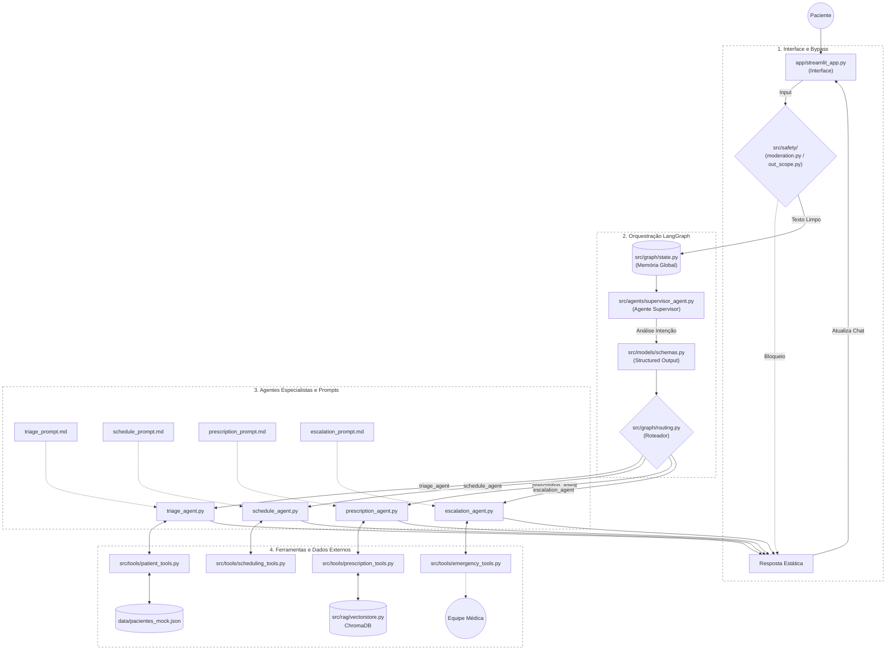

```mermaid
flowchart TB
    User((Paciente)) --> UI

    subgraph sub1 [1. Interface e Bypass]
        direction TB
        UI["app/streamlit_app.py<br>(Interface)"]
        Escudo{"src/safety/<br>(moderation.py / out_scope.py)"}
        UI -->|Input| Escudo
        Escudo -.->|Bloqueio| Output[Resposta Estática]
    end

    subgraph sub2 [2. Orquestração LangGraph]
        direction TB
        State[("src/graph/state.py<br>(Memória Global)")]
        Supervisor["src/agents/supervisor_agent.py<br>(Agente Supervisor)"]
        Pydantic["src/models/schemas.py<br>(Structured Output)"]
        Router{"src/graph/routing.py<br>(Roteador)"}

        Escudo -->|Texto Limpo| State
        State --> Supervisor
        Supervisor -->|Análise Intenção| Pydantic
        Pydantic --> Router
    end

    subgraph sub3 [3. Agentes Especialistas e Prompts]
        direction TB
        P_Triagem[triage_prompt.md] -.-> AgTriagem["triage_agent.py"]
        P_Agenda[schedule_prompt.md] -.-> AgAgenda["schedule_agent.py"]
        P_Prescricao[prescription_prompt.md] -.-> AgPrescricao["prescription_agent.py"]
        P_Escalada[escalation_prompt.md] -.-> AgEscalada["escalation_agent.py"]

        Router -->|triage_agent| AgTriagem
        Router -->|schedule_agent| AgAgenda
        Router -->|prescription_agent| AgPrescricao
        Router -->|escalation_agent| AgEscalada
    end

    subgraph sub4 [4. Ferramentas e Dados Externos]
        direction TB
        AgTriagem <--> ToolsPaciente["src/tools/patient_tools.py"]
        ToolsPaciente <--> DBMock[("data/pacientes_mock.json")]

        AgAgenda <--> ToolsAgenda["src/tools/scheduling_tools.py"]

        AgPrescricao <--> ToolsPrescricao["src/tools/prescription_tools.py"]
        ToolsPrescricao <--> RAG[("src/rag/vectorstore.py<br>ChromaDB")]

        AgEscalada <--> ToolsEmergencia["src/tools/emergency_tools.py"]
        ToolsEmergencia -.-> Notifica((Equipe Médica))
    end
    
    AgTriagem --> Output
    AgAgenda --> Output
    AgPrescricao --> Output
    AgEscalada --> Output
    Output -->|Atualiza Chat| UI

    style sub1 fill:transparent,stroke:#666,stroke-width:1px,stroke-dasharray: 5 5
    style sub2 fill:transparent,stroke:#666,stroke-width:1px,stroke-dasharray: 5 5
    style sub3 fill:transparent,stroke:#666,stroke-width:1px,stroke-dasharray: 5 5
    style sub4 fill:transparent,stroke:#666,stroke-width:1px,stroke-dasharray: 5 5
```
